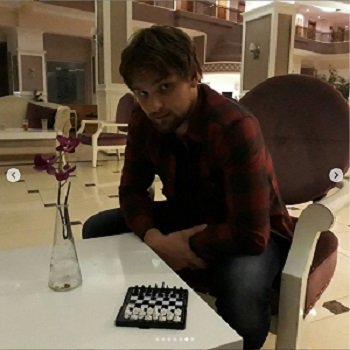

# Name:
Dmitriy Brashkin

## Contacts
* Phone: +79372336000
* GitHub: Baltika-Cat
* E-mail: Brashkin.dmitrii@gmail.com

## About myself
I'm thirty years old. My GitHub name is Baltika-Cat. However I'm not a cat. I'm a human.  
Like to code, but I code rarely and still not very good. But everything yet to come.  
I work as an electrician for low-current networks in "AVTOVAZ".  
I want to learn JavaScript, because this language is interesting in my opinion.  
Information about me looks like child letter, but it is not because I'm stupid and because my English is not good.  
Married.

## Skills
* HTML5 - downer than basic;
* CSS - really downer than basic;
* Java - really downer than basic.

## Code education
* I tried to learn Java on JavaRush, but it didn't work out for me;
* I learned HTML and CSS with a book.

## Languages levels
* Russian - native;
* English - elementary.
